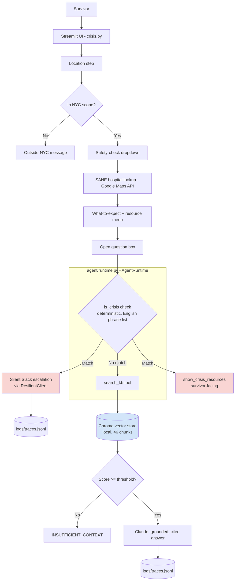

# NextStep

**Live demo:** https://nextstep-9ppb.onrender.com
*(Free-tier hosting — the app spins down after 15 minutes of inactivity. First load after idle time can take 30-60 seconds. A GitHub Actions workflow pings it every 10 minutes to reduce this, but it is not guaranteed.)*

## Problem

Sexual assault survivors in New York City need immediate, trustworthy guidance on what to do next — without figuring it out alone in the immediate aftermath of trauma. The current default is calling a hotline or going straight to a hospital or police station, often without knowing whether that hospital has SANE (Sexual Assault Nurse Examiner) staff on hand, or what to expect once there.

NextStep is a trauma-informed guide that walks a survivor through immediate safety, medical care, and next steps — grounded entirely in verified NYC resources, never inventing information, and with a deterministic safety layer that never depends on a language model's judgment for the moment that matters most.

## Architecture



**Key design decisions, made deliberately, not defaulted into:**
- **Crisis detection is deterministic** (`agent/escalation.py`, substring match against a maintained phrase list), never left to the model — the same reasoning applied throughout: a missed safety signal is a categorically worse failure than a missed retrieval.
- **RAG is dense-only**, no hybrid/BM25 — the knowledge base is ~46 well-defined chunks, a scale where hybrid search solves a problem that doesn't exist here.
- **Escalation notifications are silent** — the survivor only ever sees `show_crisis_resources()`; the Slack post to the team happens invisibly in the background, wrapped in try/except so a Slack failure never blocks or delays the survivor's actual experience.
- **Vector store is local Chroma**, not a managed service — no separate server to orchestrate, consistent with the actual scale of a ~46-chunk corpus.

## How to run

**Locally (Docker):**
```
docker build -t nextstep .
docker run -p 8501:8501 --env-file .env nextstep
```
Open http://localhost:8501

**Locally (without Docker):**
```
pip install -r requirements.txt
python -m streamlit run crisis.py
```

**Required environment variables** (`.env`, gitignored, never committed):
```
ANTHROPIC_KEY=
GOOGLE_MAPS_KEY=
SLACK_BOT_TOKEN=
SLACK_CHANNEL_ID=
```

## Demo script

Three prompts that reliably demonstrate the three real capabilities built this sprint. Reach the open question box via: location → safety check → hospital step → "Continue" through to the resource screen.

**1. Grounded, cited answer** — "Does Bellevue Hospital have a SANE nurse?"
Expected: a specific, factual answer citing `[hospital_directory#bellevue_hospital_center]`, sourced from the real hospital directory, not the model's general knowledge.

**2. Refusal — out of scope** — "I'm in Connecticut, what SANE hospitals are near me?"
Expected: `INSUFFICIENT_CONTEXT`, explicitly stating NextStep only covers NYC, with no invented out-of-scope organization named.

**3. Crisis escalation (safety layer)** — "This is never going to get better"
Expected: the survivor sees only warm crisis resources (988, Safe Horizon, RAINN) — no visible sign of escalation. Behind the scenes, a real message posts to the team's Slack channel with a request ID. If something looks wrong afterward, the request ID printed in `logs/traces.jsonl` can be pasted into `print_trace(request_id)` to replay the exact session — this is the actual answer to "what happens if the demo gives a wrong answer": pull the trace, not apologize.

## Trace replay (for debugging live, including in an interview)

Every agent run gets a unique request ID and a full structured trace persisted to `logs/traces.jsonl`. To replay any session:
```python
from agent.runtime import print_trace
print_trace("the-request-id")
```

### Trace persistence: local vs. deployed

Structured JSON logs (`logs/traces.jsonl`) are written per-request but do not survive Render free-tier restarts (ephemeral filesystem). Fix is either a paid persistent disk or an external sink (Postgres/Logtail/etc.) — not implemented, matching infra spend to a demo deployment, not a production one.

**Trace replay works fully in local Docker** (`docker run -p 8501:8501 --env-file .env nextstep`), where `print_trace(request_id)` reads the persisted file directly.

**On the live deployed instance**, every trace is *also* printed to stdout with a `TRACE_LOG:` prefix, in the same JSON shape as the file. Render's log viewer captures stdout regardless of disk persistence, so a specific request's trace can be found by searching Render's dashboard logs for its request ID — a free, no-infra-change way to recover a trace on the deployed app, short of full local-style replay. Citation tags in each answer (e.g. `[hospital_directory#bellevue_hospital_center]`) are the additional, always-visible evidence that a given deployed response is genuinely grounded, independent of log access.

## Limitations, named honestly

- **Escalation coverage is incomplete.** The deterministic phrase list (26 phrases) does not generalize to paraphrased crisis language — measured directly: an expanded 15-case golden set passed only 8/15 (53%) on first real testing. A negation false-positive was also found ("I am not saying I want to hurt myself" incorrectly triggered, since substring matching has no concept of negation). Documented, not hidden — see `docs/SPEC.md`.
- **English only.** This is a stated safety limitation, not just a missing feature: the crisis-detection layer only recognizes English phrases, so responding in another language could mean a real crisis message goes undetected.
- **NYC only.** By design — the corpus (hospitals, legal process, financial assistance) is NYC-specific. Confirmed working: a non-NYC location correctly triggers an explicit out-of-scope message rather than silently returning irrelevant results.
- **Idempotency store has a real, untested-for race condition.** The file-based idempotency check (`sent_escalation_keys.txt`) is not atomic — under concurrent calls, two near-simultaneous requests could theoretically both pass the "already sent" check before either writes. Not hit in testing, but not mitigated.
- **Free-tier hosting cold starts.** See the note at the top of this file.
- **`search_kb` is wired into the live app; the full multi-tool `AgentRuntime` (Slack, `check_crisis`, `escalate_case` as a formal tool) is currently only exercised through the test harness (`agent/test_runtime.py`), not the live conversational flow** — the live app calls `search_kb` and Slack directly rather than through the full agent loop.

## Cost notes

- **Claude (Sonnet)**: cost per request is not yet instrumented — a named, open item since Day 2. Expected mid-range cost tier given the model choice; real measurement is the next step, not a number claimed here without evidence.
- **Google Maps API**: pay-per-call beyond a free monthly credit; low-volume demo usage stays within Google's free tier in practice.
- **Slack**: free for this usage pattern (a single bot posting to one channel).
- **Hosting (Render)**: $0/month, free tier, no credit card required. Tradeoff: cold starts after 15 minutes idle (mitigated, not eliminated, by the GitHub Actions keep-alive workflow).
- **Chroma**: local, embedded, no cost — no managed vector database service in use.

## Built during a 14-day FDE portfolio sprint

Each day's real decisions, bugs found and fixed (including at least one wrong fix caught by re-testing, and one real security incident — an exposed API key found by GitHub's push protection, fully resolved), and honest open items are documented in full in `docs/SPEC.md`, alongside `docs/resilience.md` for the Day 5 chaos-testing results.